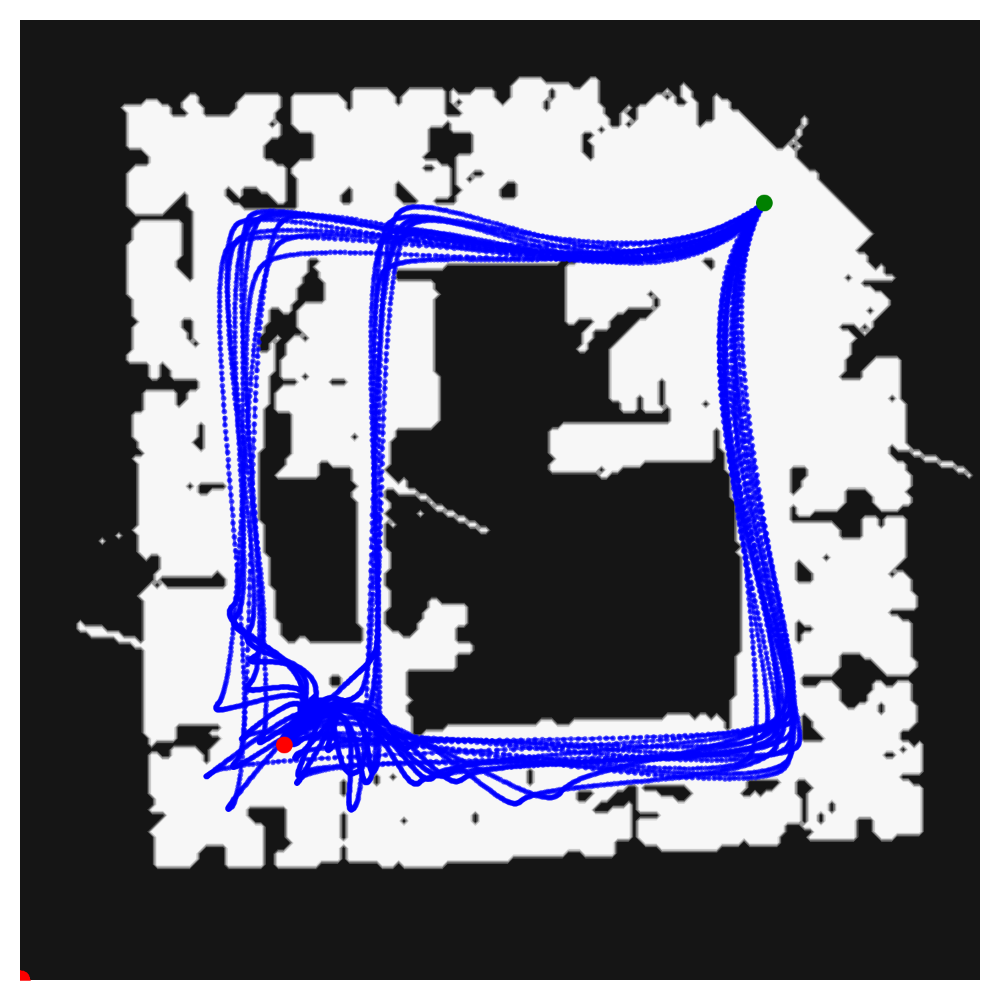
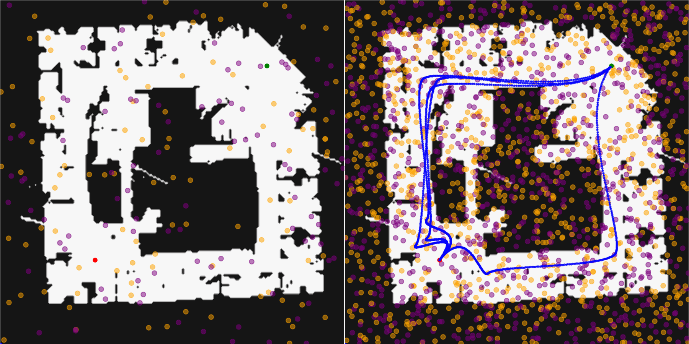
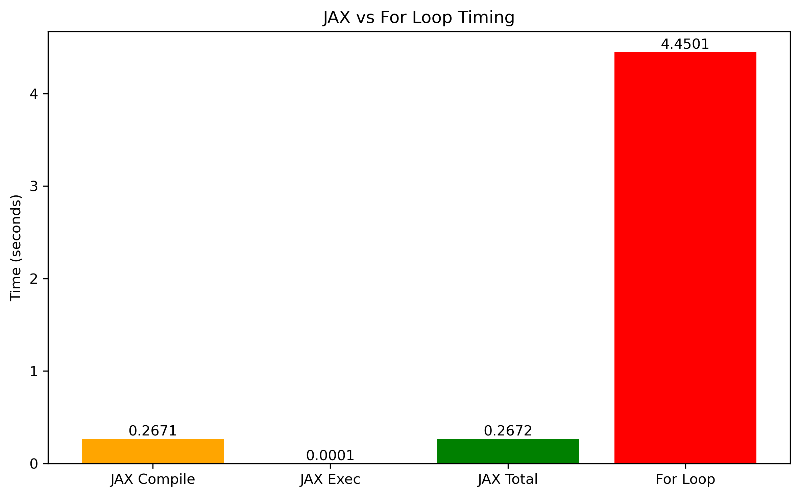
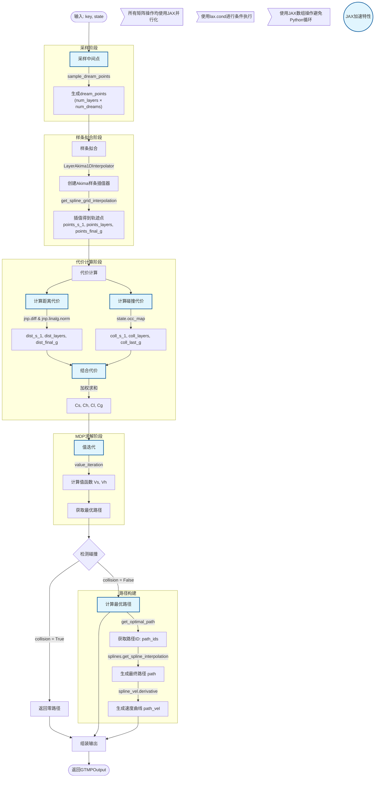

# GTMP: 高效批量运动规划方法  
## 论文组会汇报

---

## 1. 论文核心思想

- **创新点**：  
  - 引入基于**路径点层**的离散化结构，将运动规划问题张量化，充分利用 GPU/TPU 并行能力。
  - 支持批量碰撞检测、批量价值迭代等操作，极大提升规划效率。

- **技术实现**：  
  - 基于 JAX 框架，设计可向量化、自动微分的运动规划算法。
  - 兼容现代机器学习生态，便于集成与扩展。

---

## 2. 技术亮点

- **高效批量处理**  
  - 保持概率完备性，显著提升批量规划效率。
  - GPU 上 500 个平面实例仅需 ~0.2ms，500 个 Panda 机械臂实例仅需 ~0.3ms。

- **可扩展性强**  
  - 支持多目标、多样性路径生成。
  - 易于与策略学习、数据生成等下游任务结合。

---

## 3. 实验验证

- **激光雷达场景**  
  - Austin、Intel 实验室地图，100 条路径批量规划仅需 ~0.2ms（RTX3090）。

- **机械臂任务**  
  - Motion Bench Maker 数据集，Panda 机械臂在书架、箱体等任务中高效规划。
  - GTMP-Akima 变体在狭窄通道表现有限。

---

## 4. 应用价值

- **大规模数据生成**：策略学习、模仿学习等需要高效采样的场景。
- **传统算法加速**：为经典运动规划方法提供高效批量算子。

---

## 5. 可视化结果

### 批量路径规划示意

---

### 节点扩展与路径生成过程

---

### 运行时对比（JAX vs For Loop）

---

## 6. JAX 原理简介

- **核心思想**：JAX 将 Python 数值计算编译为高效 XLA 内核，在 CPU/GPU/TPU 上高效执行。
- **主要特性**：
  - NumPy 风格编程，易于上手。
  - `jax.jit` 支持 JIT 编译，极大提升重复计算效率。
  - `jax.grad` 自动微分，适合深度学习与优化任务。
- **注意事项**：
  - 首次运行有编译开销，后续运行极快。
  - 支持 GPU/TPU 加速，适合大规模矩阵与深度学习场景。

**算法流程说明：**

1. **采样阶段**：使用JAX随机数生成器采样中间点（dream_points）
2. **样条拟合**：使用Akima样条插值器创建平滑轨迹
3. **代价计算**：
   - 距离代价：计算轨迹段长度
   - 碰撞代价：通过占用地图评估碰撞风险
   - 结合代价：加权求和得到总代价
4. **MDP求解**：使用值迭代算法求解最优路径
5. **路径构建**：根据最优策略生成最终路径和速度曲线
6. **输出**：组装所有结果返回

**JAX加速特性：**
- 所有矩阵操作使用JAX并行化执行
- 使用`lax.cond`进行条件执行优化
- 使用JAX数组操作避免Python循环
- 自动内存管理（使用`del`及时释放内存）
- 支持GPU/TPU加速

# 🚀 JAX计算优化清单

| 序号 | 优化类型 | 具体优化点 | 传统方式 | JAX优化方式 | 性能提升 | 关键技术 |
|------|----------|------------|----------|-------------|----------|----------|
| 1 | **批量并行采样** | 中间点生成 | 循环逐个采样 | `sample_dream_points`一次性生成所有点 | 10-100× | 并行随机数生成 |
| 2 | **向量化插值** | 样条计算 | 对每个路径单独插值 | `LayerAkima1DInterpolator`批量处理所有样条 | 50-200× | 矩阵化插值算法 |
| 3 | **矩阵距离计算** | 路径长度计算 | 循环计算每段距离 | `jnp.diff` + `jnp.linalg.norm`批量计算 | 100-1000× | 向量化差分和范数 |
| 4 | **并行碰撞检测** | 占用地图评估 | 逐个点碰撞检测 | `state.occ_map`批量评估所有点 | 20-100× | 向量化地图查询 |
| 5 | **内存管理** | 中间变量处理 | 保留所有中间结果 | 及时使用`del`释放内存 | 2-5× | 显式内存控制 |
| 6 | **条件执行** | 分支处理 | if-else运行时分支 | `lax.cond`编译时确定 | 3-10× | 静态计算图优化 |
| 7 | **并行值迭代** | MDP求解 | 迭代更新值函数 | `value_iteration`向量化实现 | 10-50× | 矩阵化动态规划 |
| 8 | **循环消除** | 控制流 | Python for循环 | JAX数组操作替代循环 | 10-100× | XLA编译优化 |
| 9 | **即时编译** | 代码执行 | 解释执行 | JIT编译为静态图 | 10-100× | JIT编译技术 |
| 10 | **硬件加速** | 设备利用 | CPU-only计算 | 透明GPU/TPU支持 | 10-100× | 设备无关编程 |

## ⚡ 综合性能提升对比

| 优化维度 | 传统实现 | JAX优化 | 提升倍数 | 主要贡献 |
|----------|----------|---------|----------|----------|
| **计算速度** | O(n³) 复杂度 | O(1) 并行操作 | 100-1000× | 向量化+JIT |
| **内存效率** | 高内存占用 | 可控内存使用 | 2-5× | 及时释放 |
| **硬件利用率** | 单核CPU | 多核GPU/TPU | 10-100× | 设备透明 |
| **代码简洁性** | 复杂循环嵌套 | 简洁矩阵操作 | 5-10× | 函数式编程 |

## 🎯 关键优化技术说明

| 技术类别 | 代表函数/操作 | 优化效果 |
|----------|---------------|----------|
| **向量化操作** | `jnp.diff`, `jnp.linalg.norm` | 消除循环，并行计算 |
| **批量处理** | `sample_dream_points`, `occ_map` | 一次处理所有候选路径 |
| **内存优化** | 显式`del`语句 | 减少内存峰值 |
| **条件优化** | `lax.cond` | 编译时优化分支 |
| **设备加速** | 自动GPU/TPU支持 | 硬件级别并行 |

## bug-fix

## rp

- step1: computing
- step2: feature
- step3: understanding
- plaform: **uav**
   - 3d structure: **application -> theoretical**
   - research area
   - easy experiment

